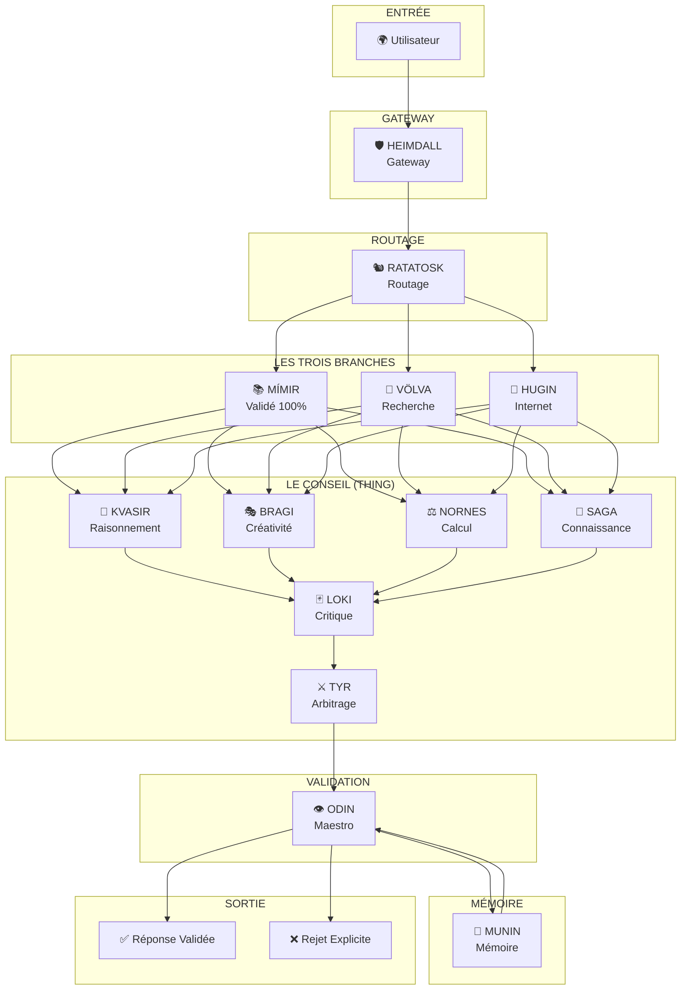
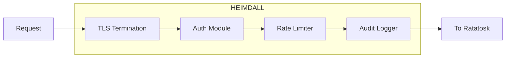
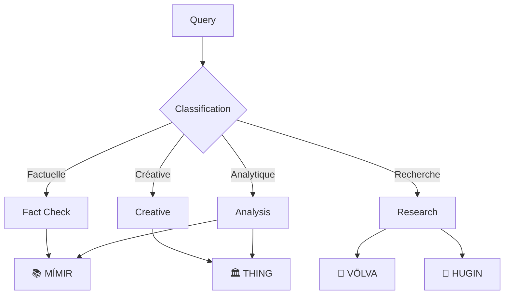
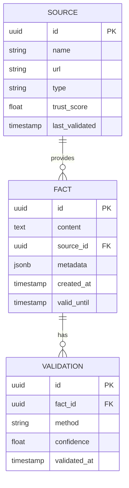
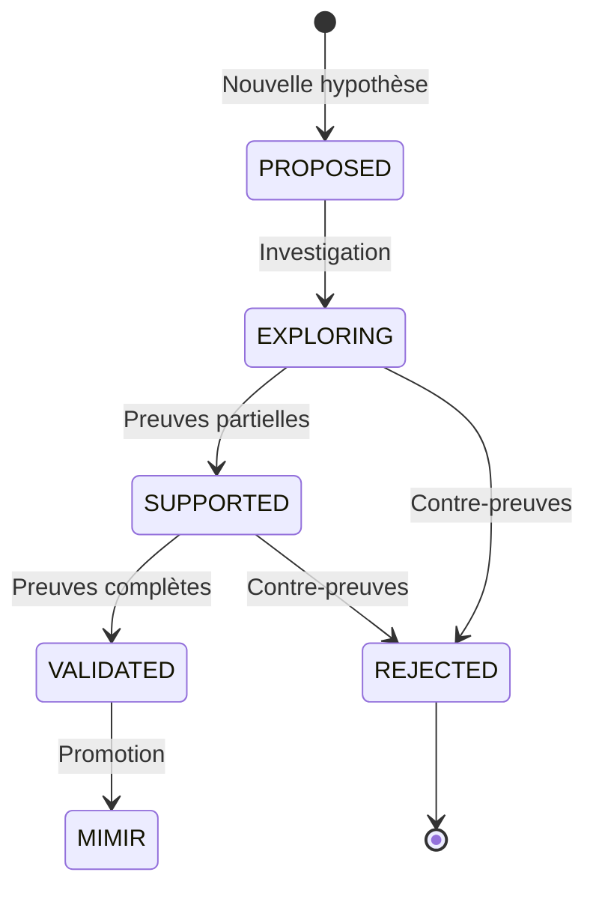
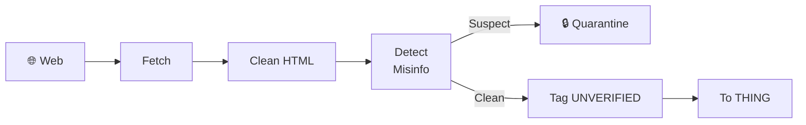
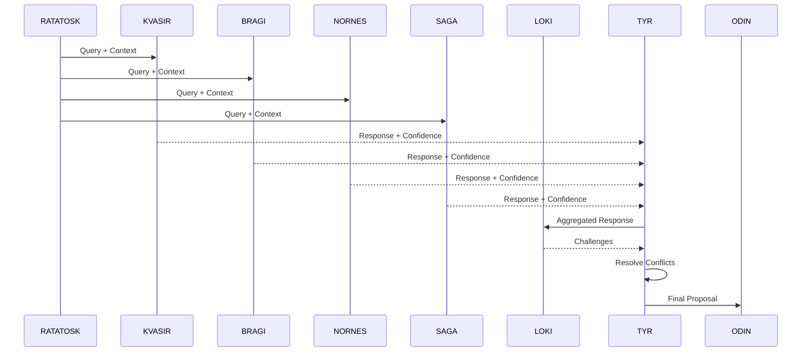
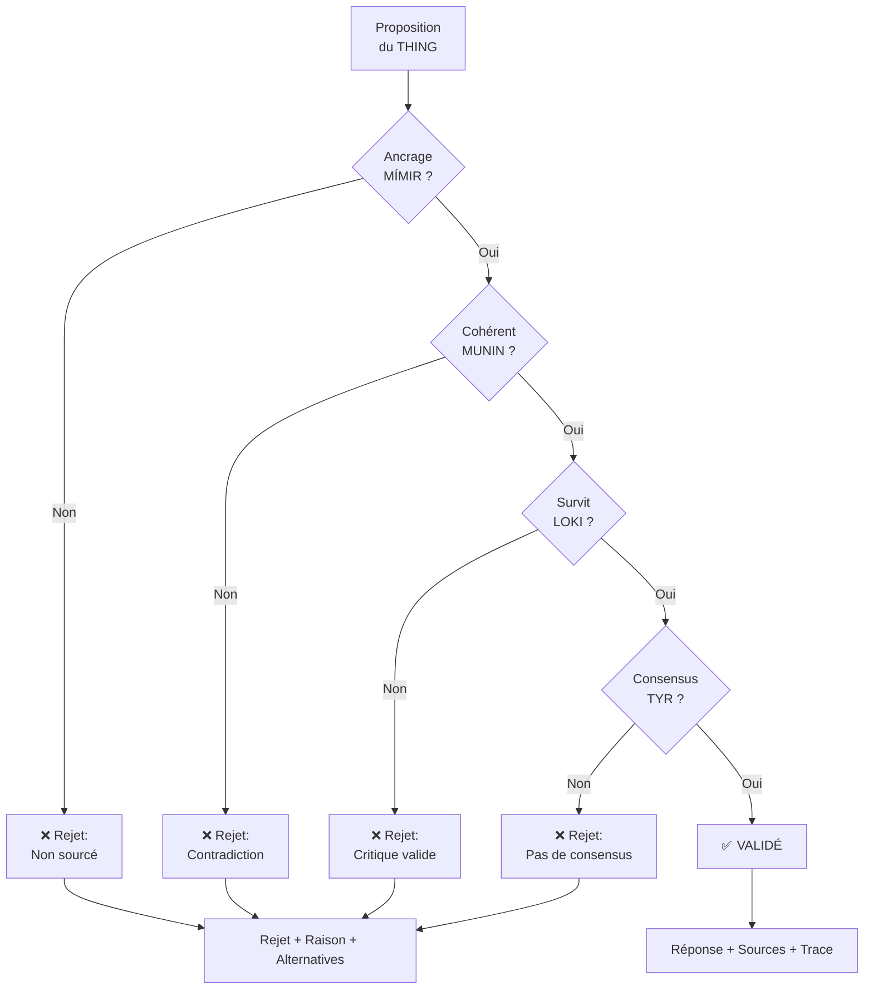
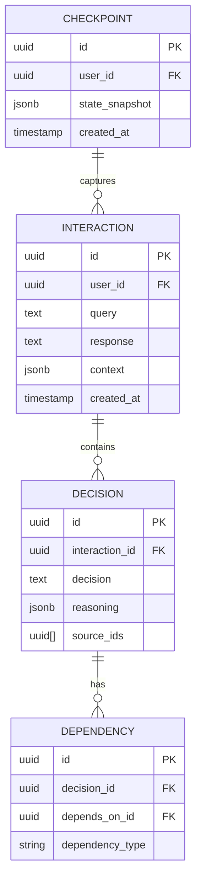

# 🏗️ Architecture YGGDRASIL

> *"Yggdrasil, le frêne toujours vert, se dresse au centre de l'univers, ses branches s'étendant sur tous les mondes."*

## Vue d'Ensemble

YGGDRASIL est une architecture d'orchestration d'IA conçue pour garantir la véracité, la traçabilité et la souveraineté. Elle ne crée pas de nouveau modèle — elle orchestre l'existant avec une couche de validation inviolable.

---

## Composants Détaillés

### 🛡️ HEIMDALL — Le Gardien

**Inspiration :** Le dieu qui garde le Bifröst, capable de voir à cent lieues et d'entendre l'herbe pousser.

**Responsabilités :**
- Authentification et autorisation
- Rate limiting et protection DDoS  
- Chiffrement TLS/mTLS
- Audit logging de toutes les requêtes
- Validation des entrées

**Stack technique :**
- NestJS avec Passport
- Redis pour le rate limiting
- PostgreSQL pour l'audit log

---

### 🐿️ RATATOSK — Le Messager

**Inspiration :** L'écureuil qui court le long d'Yggdrasil, portant les messages entre les mondes.

**Responsabilités :**
- Classification de la requête (factuelle, créative, analytique, etc.)
- Extraction du contexte et des intentions
- Routage vers la/les branches appropriées
- Enrichissement avec le contexte de MUNIN

**Algorithme de routage :**

---

### 📚 MÍMIR — Le Puits de Sagesse

**Inspiration :** Le puits gardé par Mímir où Odin sacrifia un œil pour une gorgée de sagesse.

**Responsabilités :**
- Stocker les connaissances **100% vérifiées**
- Indexation sémantique des sources
- Vérification de la validité temporelle
- Mise à jour continue avec validation

**Sources intégrées :**
| Source | Type | Domaine |
|--------|------|---------|
| arXiv | Preprints | Sciences |
| PubMed | Peer-reviewed | Médical |
| ISO | Standards | Technique |
| RFC | Standards | Internet |
| Wikidata | Structured | Général |

**Architecture de données :**

---

### 🔮 VÖLVA — La Voyante

**Inspiration :** Les prophétesses nordiques qui exploraient l'inconnu et conseillaient les dieux.

**Responsabilités :**
- Stocker les hypothèses et théories
- Tracker le niveau de preuve
- Gérer la promotion vers MÍMIR
- Flaguer systématiquement comme `THEORETICAL`

**États d'une hypothèse :**

---

### 🦅 HUGIN — La Pensée

**Inspiration :** Un des deux corbeaux d'Odin qui parcourt le monde pour lui rapporter ce qu'il voit.

**Responsabilités :**
- Interface avec le web en temps réel
- Filtrage anti-désinformation
- Détection de sources douteuses
- Tagging systématique `UNVERIFIED`

**Pipeline de filtrage :**

---

### 🏛️ THING — L'Assemblée

**Inspiration :** L'assemblée viking où les décisions collectives étaient prises.

**Responsabilités :**
- Orchestrer les modèles spécialisés
- Agréger les réponses
- Gérer le consensus
- Soumettre à la critique de LOKI

**Membres du conseil :**

| Membre | Modèle | Spécialité | Poids |
|--------|--------|------------|-------|
| KVASIR | Claude | Raisonnement | Variable |
| BRAGI | Grok | Créativité | Variable |
| NORNES | DeepSeek | Calcul | Variable |
| SAGA | Llama | Connaissance | Variable |
| LOKI | Adversarial | Critique | Veto power |
| TYR | Voting | Arbitrage | Final |

**Processus de délibération :**

---

### 👁️ ODIN — Le Maestro

**Inspiration :** Le Père-de-Tout, qui a sacrifié un œil pour la sagesse et s'est pendu à Yggdrasil pour la connaissance.

**Responsabilités :**
- Validation finale de chaque affirmation
- Ancrage obligatoire à MÍMIR
- Vérification de cohérence avec MUNIN
- Rejet explicite avec raison si <100%

**Critères de validation :**

**Règle d'or :** *"Je ne valide que ce que je peux prouver."*

---

### 🦅 MUNIN — La Mémoire

**Inspiration :** Le corbeau de la mémoire, celui qu'Odin craignait de perdre plus que Hugin.

**Responsabilités :**
- Mémoire chrono-sémantique persistante
- Graphe de dépendances entre décisions
- Système de checkpoints
- Rollback sur erreur détectée

**Architecture de stockage :**

**Triple indexation :**
- **Temporelle** : Quand ?
- **Sémantique** : À propos de quoi ? (PGVector)
- **Causale** : À cause de quoi ?

---

## Flux Complet

---

## Stack Technique

### Backend
- **Framework** : NestJS (TypeScript)
- **Base de données** : PostgreSQL + PGVector
- **Cache** : Redis
- **Queue** : BullMQ
- **ORM** : Prisma

### Infrastructure
- **Conteneurs** : Docker
- **Orchestration** : Kubernetes (optionnel)
- **IaC** : Terraform
- **CI/CD** : GitHub Actions

### Modèles IA
- **Claude** : Via API Anthropic
- **Llama** : Via Ollama (local) ou API
- **DeepSeek** : Via API
- **Grok** : Via API xAI

### Observabilité
- **Logs** : Structured JSON (Pino)
- **Metrics** : Prometheus
- **Traces** : OpenTelemetry
- **Dashboards** : Grafana

---

## Sécurité

### Chiffrement
- TLS 1.3 pour toutes les communications
- mTLS entre services internes
- Chiffrement at-rest pour les données sensibles

### Authentification
- JWT avec refresh tokens
- Support OAuth2/OIDC
- Rate limiting par utilisateur et IP

### Audit
- Logging immutable de toutes les requêtes
- Traçabilité complète des décisions
- Retention configurable

---

## Prochaines Étapes

1. **Implémenter HEIMDALL** — Gateway de base
2. **Implémenter RATATOSK** — Routage simple
3. **Intégrer MÍMIR** — Avec arXiv comme première source
4. **Construire THING** — Orchestration de 2 modèles
5. **Développer ODIN** — Validation basique

---

*"L'architecture est le squelette. Les principes sont l'âme."*

🌲

