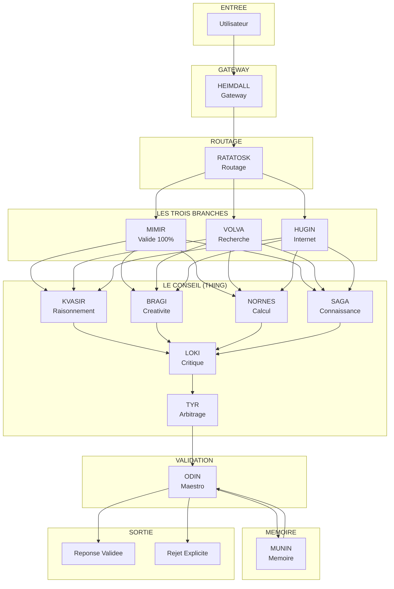
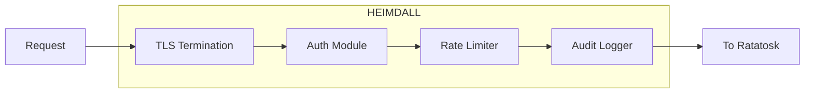
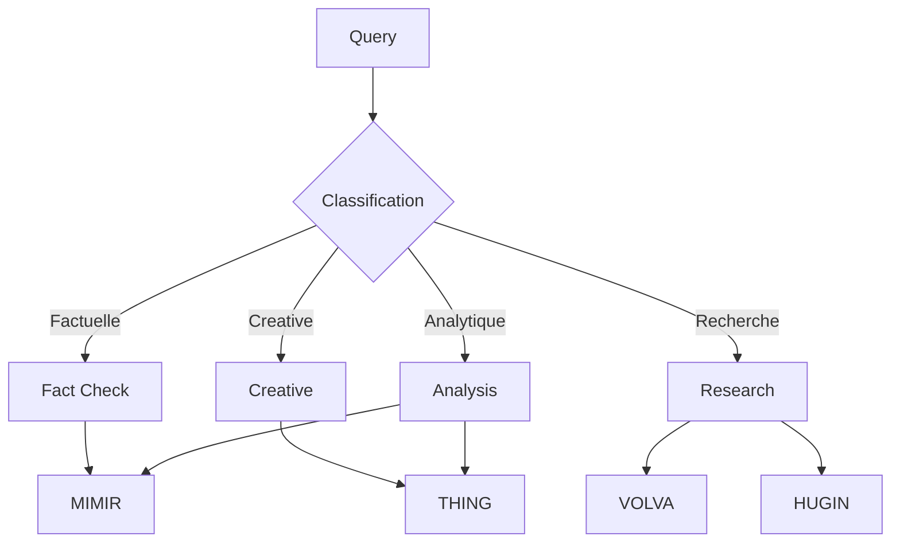
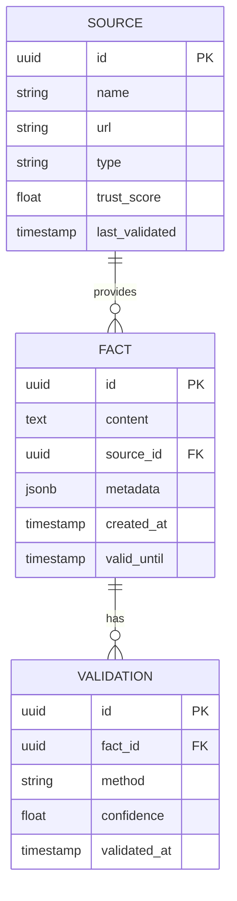
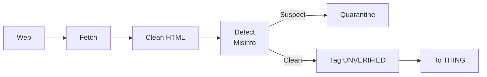
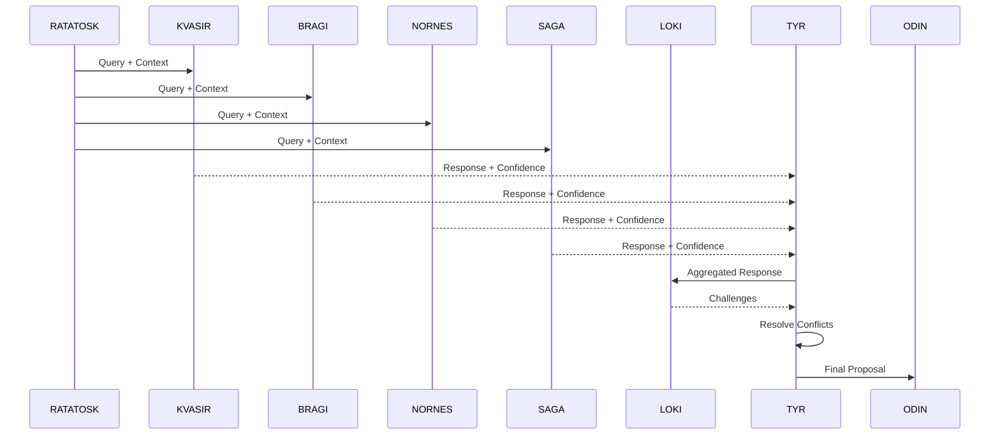
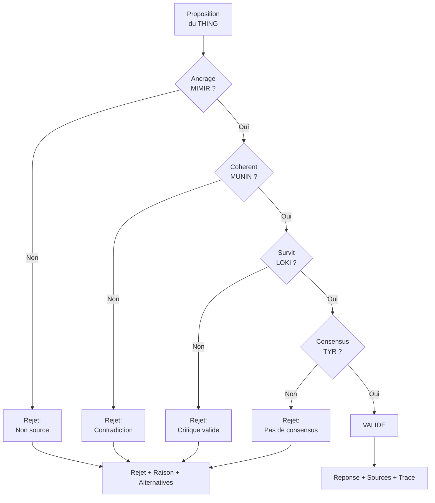
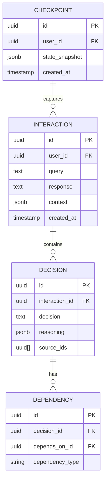
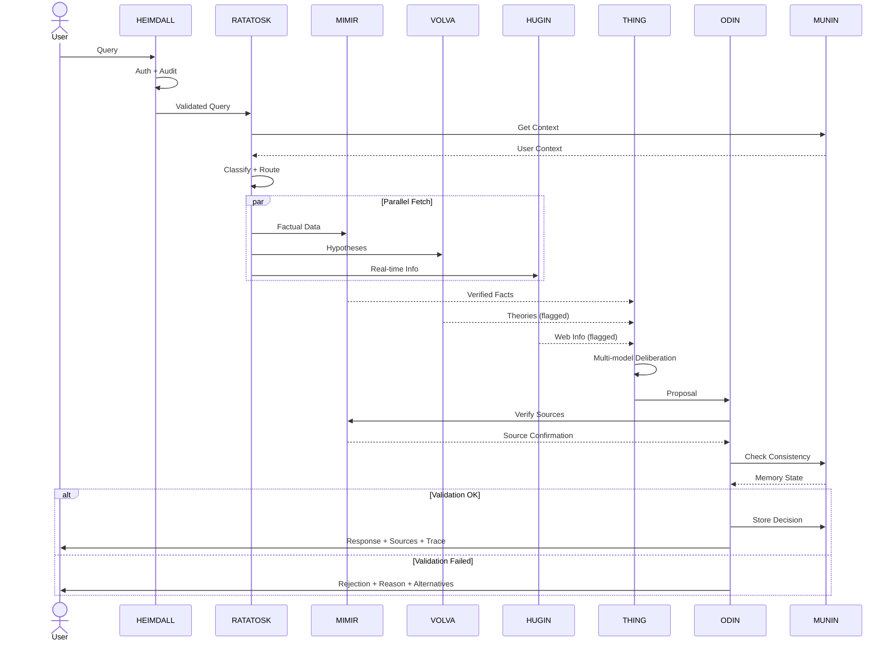

# Architecture YGGDRASIL

> _"Yggdrasil, le frene toujours vert, se dresse au centre de l'univers, ses branches s'etendant sur tous les mondes."_

## Vue d'Ensemble

YGGDRASIL est une architecture d'orchestration d'IA concue pour garantir la veracite, la tracabilite et la souverainete. Elle ne cree pas de nouveau modele — elle orchestre l'existant avec une couche de validation inviolable.

---

## Composants Detailles

### HEIMDALL — Le Gardien

**Inspiration :** Le dieu qui garde le Bifrost, capable de voir a cent lieues et d'entendre l'herbe pousser.

**Responsabilites :**

- Authentification et autorisation
- Rate limiting et protection DDoS
- Chiffrement TLS/mTLS
- Audit logging de toutes les requetes
- Validation des entrees

**Stack technique :**

- NestJS avec Passport
- Redis pour le rate limiting
- PostgreSQL pour l'audit log

---

### RATATOSK — Le Messager

**Inspiration :** L'ecureuil qui court le long d'Yggdrasil, portant les messages entre les mondes.

**Responsabilites :**

- Classification de la requete (factuelle, creative, analytique, etc.)
- Extraction du contexte et des intentions
- Routage vers la/les branches appropriees
- Enrichissement avec le contexte de MUNIN

**Algorithme de routage :**

---

### MIMIR — Le Puits de Sagesse

**Inspiration :** Le puits garde par Mimir ou Odin sacrifia un oeil pour une gorgee de sagesse.

**Responsabilites :**

- Stocker les connaissances **100% verifiees**
- Indexation semantique des sources
- Verification de la validite temporelle
- Mise a jour continue avec validation

**Sources integrees :**

| Source   | Type          | Domaine   |
| -------- | ------------- | --------- |
| arXiv    | Preprints     | Sciences  |
| PubMed   | Peer-reviewed | Medical   |
| ISO      | Standards     | Technique |
| RFC      | Standards     | Internet  |
| Wikidata | Structured    | General   |

**Architecture de donnees :**

---

### VOLVA — La Voyante

**Inspiration :** Les prophetesses nordiques qui exploraient l'inconnu et conseillaient les dieux.

**Responsabilites :**

- Stocker les hypotheses et theories
- Tracker le niveau de preuve
- Gerer la promotion vers MIMIR
- Flaguer systematiquement comme `THEORETICAL`

**Etats d'une hypothese :**

---

### HUGIN — La Pensee

**Inspiration :** Un des deux corbeaux d'Odin qui parcourt le monde pour lui rapporter ce qu'il voit.

**Responsabilites :**

- Interface avec le web en temps reel
- Filtrage anti-desinformation
- Detection de sources douteuses
- Tagging systematique `UNVERIFIED`

**Pipeline de filtrage :**

---

### THING — L'Assemblee

**Inspiration :** L'assemblee viking ou les decisions collectives etaient prises.

**Responsabilites :**

- Orchestrer les modeles specialises
- Agreger les reponses
- Gerer le consensus
- Soumettre a la critique de LOKI

**Membres du conseil (Configuration Actuelle) :**

| Membre     | Modele                   | Provider | Specialite            |
| ---------- | ------------------------ | -------- | --------------------- |
| **KVASIR** | Gemini 2.5 Pro           | Google   | Raisonnement profond  |
| **BRAGI**  | Gemini 2.5 Flash         | Google   | Synthese creative     |
| **SYN**    | Gemini 2.5 Pro           | Google   | Vision multimodale    |
| **NORNES** | Qwen QWQ-32B             | Groq     | Raisonnement avance   |
| **SAGA**   | Llama 3.3 70B            | Groq     | Connaissance generale |
| **LOKI**   | DeepSeek R1 Distill 70B  | Groq     | Critique adversariale |
| **TYR**    | Systeme de vote          | Local    | Arbitrage final       |

**Processus de deliberation :**

---

### ODIN — Le Maestro

**Inspiration :** Le Pere-de-Tout, qui a sacrifie un oeil pour la sagesse et s'est pendu a Yggdrasil pour la connaissance.

**Responsabilites :**

- Validation finale de chaque affirmation
- Ancrage obligatoire a MIMIR
- Verification de coherence avec MUNIN
- Rejet explicite avec raison si <100%

**Criteres de validation :**

**Regle d'or :** _"Je ne valide que ce que je peux prouver."_

---

### MUNIN — La Memoire

**Inspiration :** Le corbeau de la memoire, celui qu'Odin craignait de perdre plus que Hugin.

**Responsabilites :**

- Memoire chrono-semantique persistante
- Graphe de dependances entre decisions
- Systeme de checkpoints
- Rollback sur erreur detectee

**Architecture de stockage :**

**Triple indexation :**

- **Temporelle** : Quand ?
- **Semantique** : A propos de quoi ? (PGVector)
- **Causale** : A cause de quoi ?

---

## Flux Complet

---

## Stack Technique

### Backend

- **Framework** : NestJS (TypeScript)
- **Base de donnees** : PostgreSQL + PGVector
- **Cache** : Redis
- **Queue** : BullMQ
- **ORM** : Prisma

### Infrastructure

- **Conteneurs** : Docker
- **Orchestration** : Kubernetes (optionnel)
- **IaC** : Terraform
- **CI/CD** : GitHub Actions

### Modeles IA

- **Claude** : Via API Anthropic
- **Llama** : Via Ollama (local) ou API
- **DeepSeek** : Via API
- **Grok** : Via API xAI

### Observabilite

- **Logs** : Structured JSON (Pino)
- **Metrics** : Prometheus
- **Traces** : OpenTelemetry
- **Dashboards** : Grafana

---

## Securite

### Chiffrement

- TLS 1.3 pour toutes les communications
- mTLS entre services internes
- Chiffrement at-rest pour les donnees sensibles

### Authentification

- JWT avec refresh tokens
- Support OAuth2/OIDC
- Rate limiting par utilisateur et IP

### Audit

- Logging immutable de toutes les requetes
- Tracabilite complete des decisions
- Retention configurable

---

## Etat Actuel (Decembre 2025)

### Composants Implementes

- [x] **HEIMDALL** — Gateway complete (auth JWT, rate limiting, audit)
- [x] **RATATOSK** — Routage intelligent avec classification
- [x] **MIMIR** — Integration arXiv + PubMed, embeddings Gemini
- [x] **VOLVA** — Gestion des hypotheses avec flagging
- [x] **HUGIN** — Recherche web avec filtrage basique
- [x] **THING** — Conseil 6 membres (Gemini + Groq)
- [x] **ODIN** — Validation avec ancrage sources
- [x] **MUNIN** — Memoire chrono-semantique PGVector
- [x] **BIFROST** — Interface chat Next.js avec streaming

### Prochaines Etapes

1. **Tests** — Couverture >80% sur tous les packages
2. **HUGIN** — Detection de desinformation avancee
3. **MUNIN** — Graphe de dependances et rollback
4. **Documentation** — API OpenAPI complete
5. **Benchmarks** — Mesurer taux de hallucination et validation

---

_"L'architecture est le squelette. Les principes sont l'ame."_

_Derniere mise a jour : Decembre 2025_

